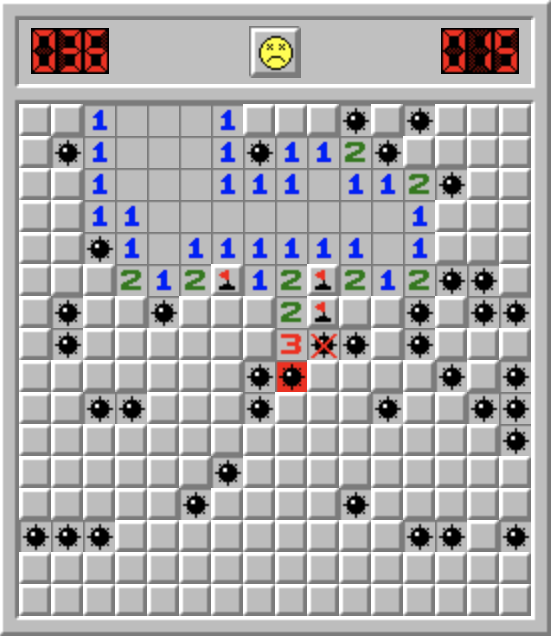
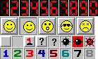

# Тестовое задание ВК стажировка

### Ссылка на деплой

[Vercel](https://someurl.come)

### Для запуска локально

```bash
git clone https://github.com/dxxbletriiiple/minesweeper.git
cd minesweeper2
npm i
npm run dev
```

## Профильное задание

## Уважаемый кандидат, предлагаем написать всем известную игру сапер, используя HTML, CSS, JavaScript и приложенный спрайт.

### Правила:

- [x] поле 16x16 клеток, 40 мин
- [x] слева счетчик мин от 40 до нуля, справа секундомер
- [x] мины расставляются случайно
- [ ] первый клик никогда не должен быть по мине
- [ ] если рядом с открытым полем есть другие поля без мин поблизости, они открываются автоматически
- [x] правая клавиша ставит флажок - так отмечается место, где предполагается мина
- [x] если кликнуть правой кнопкой по флажку, ставится вопрос, еще раз - выделение снимается
- [x] клик по смайлику перезапускает игру
- [x] испуганный смайлик - пользователь нажал на поле, но еще не отпустил кнопку мышки
- [x] после проигрыша смайлик заменяется на грустный, пользователю раскрывается карта мин
- [x] после того, как пользователь открыл все поля кроме мин, смайлик надевает солнечные очки, секундомер останавливается.



Мы не ограничиваем Вас в использовании технологий, библиотек и фреймворков. Результатом выполнения задачи должен стать репозиторий на гитхабе с инструкцией для запуска. Можете для удобства выложить работающий пример в общий доступ.

Спрайт:


